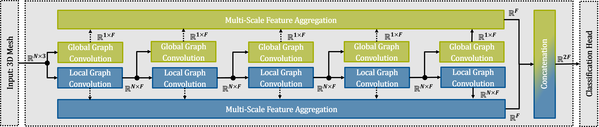

# Unifying Local and Global Shape Descriptors to Grade Soft-Tissue Sarcomas using GCNs

The tumor grading of patients suffering from soft-tissue sarcomas is a critical task, as an accurate classification of this high-mortality cancer entity constitutes a decisive factor in devising optimal treatment strategies. In this work, we focus on distinguishing soft-tissue sarcoma subtypes solely based on their 3D morphological characteristics, derived from tumor segmentation masks. Notably, we direct attention to overcoming the limitations of texture-based methodologies, which often fall short of providing adequate shape delineation. To this end, we propose a novel yet elegant modular geometric deep learning framework coined Global Local Graph Convolutional Network (GloLo-GCN) that integrates local and global shape characteristics into a meaningful unified shape descriptor. Evaluated on a multi-center dataset, our proposed model performs better in soft-tissue sarcoma grading than GCNs based on state-of-the-art graph convolutions and a volumetric 3D convolutional neural network, also evaluated on binary segmentation masks exclusively.

  

Source code will be made publicly available upon accept/reject notification.
